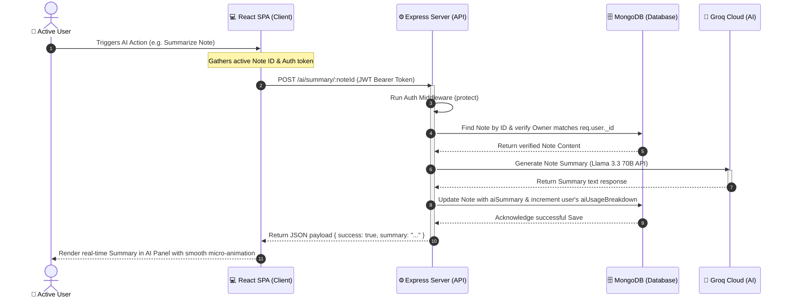

# 🚀 NotePilot AI Workspace

NotePilot AI is a professional, production-ready AI-powered productivity workspace inspired by modern SaaS productivity tools like Notion and Evernote. Built using a robust monorepo architecture, NotePilot AI integrates a high-performance React frontend and an Express/Mongoose backend, leveraging **Groq's Llama 3.3 70B model** to deliver real-time note summarization, smart tag and title suggestion, action-item extraction, and writing quality enhancements.

---

## 🏗️ Architecture Explanation & System Data Flow

NotePilot AI utilizes a decoupled **Client-Server Architecture** incorporating a clean MVC (Model-View-Controller) structure on the backend and a centralized context-based state management structure on the frontend. 

The client communicates with the backend via a centralized, JWT-authenticated API layer managed by Axios interceptors. The backend manages local data with MongoDB Atlas (via Mongoose schemas) and delegates advanced language processing tasks to the Groq Cloud AI Engine.

### 📊 System Data Flow Diagram

The diagram below details the data flow from client interactions to database updates and Groq AI orchestrations:



---

## 🛠️ Technology Stack

NotePilot AI is built using modern, highly performant tools across the entire stack:

| Layer | Technology | Details | Badge |
|---|---|---|---|
| **Frontend** | React 19 (Vite) | High-performance SPA with fast hot reloading |  |
| **Styling** | Vanilla CSS | Premium dark-mode variables and micro-animations |  |
| **Backend** | Node.js & Express 5 | Robust asynchronous RESTful API architecture |  |
| **Database** | MongoDB & Mongoose | Scalable, document-oriented storage with ODM schemas |  |
| **AI Engine** | Groq Cloud SDK | Ultra-fast Llama 3.3 70B Versatile model integration |  |
| **Security** | JWT & Bcrypt | Bulletproof user session state & encrypted password storage |  |

---

## ✨ Features

- **🛡️ Secure JWT Authentication**: Full signup and login capability with automated browser-autofill prevention, password salting via `bcryptjs`, and secure token verification.
- **📝 High-Fidelity Workspace**: Inspired by modern SaaS tools, featuring a sleek, responsive three-column grid layout (Sidebar, Notes List, and interactive Note Editor).
- **🤖 Advanced AI Integration (Groq Llama 3.3 70B)**:
  - **Auto-Summarization**: Instantly condenses long paragraphs into concise, readable summaries.
  - **Action Items**: Extracts direct todo lists and checkboxes from your raw notes.
  - **Smart Title Generation**: Suggests short, context-aware, punchy titles (max 5 words).
  - **Smart Tags**: Evaluates notes and suggests 3 contextually relevant, searchable tags.
  - **Writing Improvement**: Instantly corrects grammar and polishes tone for professional use.
- **📊 Real-time Productivity Dashboard**: Includes dynamic charts visualizing active notes, public shared notes, and a detailed, action-by-action **AI Usage Breakdown donut chart** with custom legend stats.
- **🔗 Secure Public Sharing**: Generates unique cryptographic tokens for users to securely share view-only notes publicly.
- **🌓 Adaptive Aesthetics**: Beautiful, Harmonious Color Palettes supporting Dark Mode persistence via localized React Context providers.
- **🔍 Fast Search & Categorization**: Instant client-side search indexing and clean note category filtering.
- **💾 Automatic Debounced Saving**: Seamlessly saves note draft updates in the background as you type.

---

## 🔑 Environment Setup

The application separates frontend and backend environment configurations. Fill in these properties to establish the localized connections.

### Backend Configurations (`backend/.env`)
Create a `.env` file in the `backend` directory and add:
```env
PORT=8080
MONGO_URI=mongodb+srv://<username>:<password>@cluster.mongodb.net/notepilot
JWT_SECRET=your_super_secret_jwt_key
GROQ_API_KEY=gsk_your_groq_api_token
```
*   `PORT`: Local server port (defaults to 8080).
*   `MONGO_URI`: The MongoDB Atlas connection string for user and note persistence.
*   `JWT_SECRET`: Unique secret string to sign and verify JSON Web Tokens.
*   `GROQ_API_KEY`: API credentials from Groq Console to power the Llama 3.3 LLM features.

### Frontend Configurations (`frontend/.env.local`)
Create a `.env.local` file in the `frontend` directory and add:
```env
VITE_API_URL=http://localhost:8080
```
*   `VITE_API_URL`: Points to your localized or deployed Express backend API root.

---

## 🚀 Installation & Running Locally

### 1. Clone the repository
```bash
git clone https://github.com/kanishkadubey16/NotePilot_AI_Workspace.git
cd NotePilot_AI_Workspace
```

### 2. Startup Backend Server
```bash
cd backend
npm install
# Set up your backend/src/.env variables
npm run dev
```
*The server will initialize on port 8080 (`http://localhost:8080`).*

### 3. Startup Frontend Client
```bash
cd ../frontend
npm install
# Set up your frontend/src/.env.local variables
npm run dev
```
*Vite will compile and launch the client web workspace locally (`http://localhost:5173`).*

---

## 🔌 API Routes Specifications

The backend follows RESTful principles and is mounted directly with secure JWT validation interceptors:

| Route Path | Method | Access | Headers | Description |
|---|---|---|---|---|
| **Authentication Services** | | | | |
| `/auth/signup` | POST | Public | None | Create a new user account |
| `/auth/login` | POST | Public | None | Authenticate credentials and return signed token |
| `/auth/me` | GET | Private | `Authorization: Bearer <token>` | Retrieve current authenticated user profile |
| `/auth/profile` | PUT | Private | `Authorization: Bearer <token>` | Update name, email, or reset password details |
| `/auth/profile` | DELETE | Private | `Authorization: Bearer <token>` | Delete user account and all associated notes |
| **Note Workspace** | | | | |
| `/notes` | GET | Private | `Authorization: Bearer <token>` | Fetch all non-archived notes for the user |
| `/notes` | POST | Private | `Authorization: Bearer <token>` | Initialize and save a new note draft |
| `/notes/:id` | GET | Private | `Authorization: Bearer <token>` | Fetch detailed contents of a specific note |
| `/notes/:id` | PUT | Private | `Authorization: Bearer <token>` | Save updates to titles, content, tags, or category |
| `/notes/:id` | DELETE | Private | `Authorization: Bearer <token>` | Delete a specific note |
| `/notes/share/:shareToken` | GET | Public | None | Fetch publicly shared note (Read-Only access) |
| **Groq AI Assistants** | | | | |
| `/ai/summary/:noteId` | POST | Private | `Authorization: Bearer <token>` | Generate executive summary from note content |
| `/ai/action-items/:noteId` | POST | Private | `Authorization: Bearer <token>` | Extract todo checklist as formatted JSON |
| `/ai/suggest-title/:noteId` | POST | Private | `Authorization: Bearer <token>` | Suggest short professional title for note |
| `/ai/suggest-tags/:noteId` | POST | Private | `Authorization: Bearer <token>` | Suggest 3 context-aware tags from note body |
| `/ai/improve-writing/:noteId`| POST | Private | `Authorization: Bearer <token>` | Refine note text to be clear and professional |
| **Dashboard Analytics** | | | | |
| `/dashboard/stats` | GET | Private | `Authorization: Bearer <token>` | Fetch total counts, weekly activity, and AI action metrics |

---

## 🤝 Contact & Contributions

Created with passion by **Kanishka Dubey** — feel free to explore the repository, open issues, or submit merge requests! Let's continue building high-performance web products.
